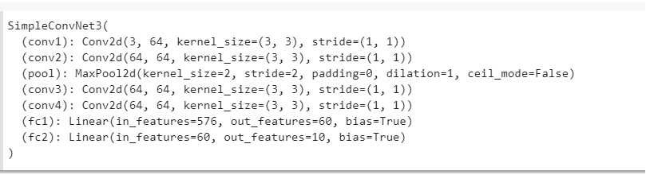

# pytorch-lt-lesson3
PyTorch|Convolution|filters|archeture
# Convolution
1. In this [task]() we create conv layer from scratch, we use ` for`and `for` for convolution img,and learned about kernel,padding,strade,polling e.t.c
also we can use some filters, f.e Gaussian Blur 

this gif illustrate how work convolution layaer
2. In second task we 
⋅⋅*work with dataset `CIFAR10` 
  
⋅⋅*created different architecture of model CNN f.e 
